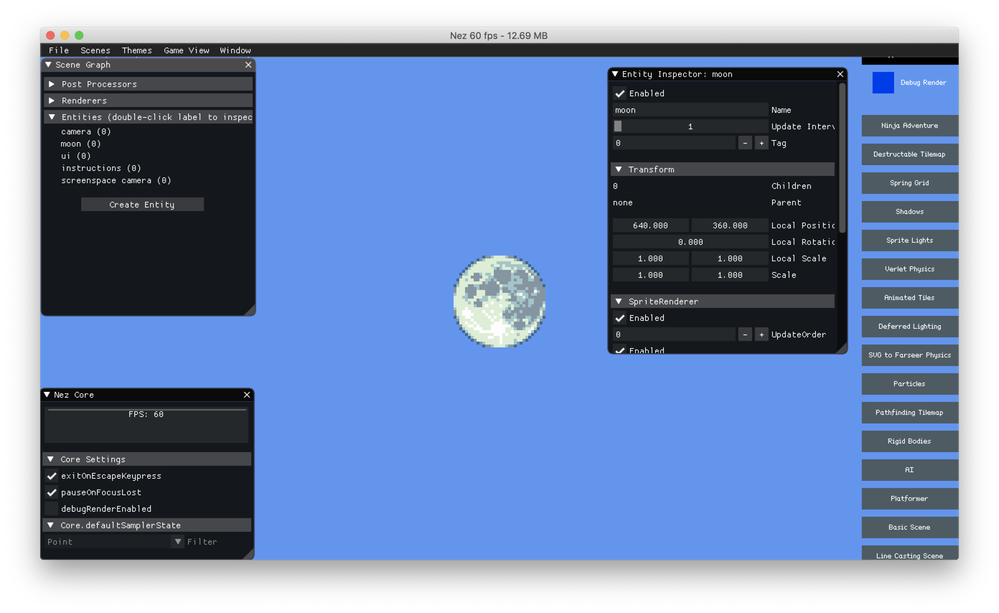

Dear IMGUI
==========

## Setup

Your main project just needs a reference to the Nez.ImGui project. The ImGui UI can be shown two different ways: by installing a `GlobalManager` manually or using the normal Nez debug console. ImGui installs it's own command (toggle-imgui) that takes care of installing the `GlobalManager` for you. Note that because ImGui is it's own assembly if you want the ImGui command to get loaded you have to manually load the assembly like this: `System.Reflection.Assembly.Load("Nez.ImGui")`.

To manually install the ImGui manager, use the following code:

```csharp
var imGuiManager = new ImGuiManager();
Core.RegisterGlobalManager( imGuiManager );

// toggle ImGui rendering on/off. It starts out enabled.
imGuiManager.SetEnabled(false);
```




See the [Nez.ImGui README](../Nez.ImGui/README.md) for more information and examples.
