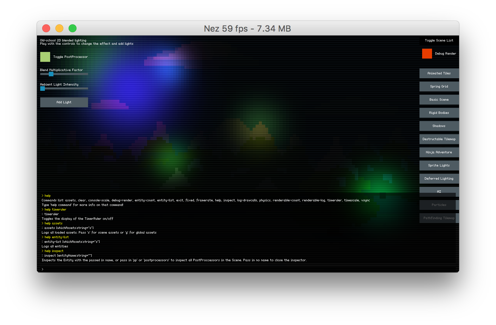

Nez Core
==========
The root class in the Nez world is the Core class which is a subclass of the Game class. Your Game class should subclass Core. Core provides access to all the important subsystems via static fields and methods for easy access.


## Graphics
Nez will create an instance of the Graphics class (available via `Graphics.Instance`) for you at startup. It includes a default BitmapFont so you can be up and running right away with good looking text (MonoGames SpriteFont has some terrible compression going on) and should cover most of your rendering needs. Graphics provides direct access to a SpriteBatch and there is a SpriteBatch extension class with a bunch of helpers for drawing rectangles, circles, lines, etc.


## Scene
When you set Core.scene to a new Scene, Nez will finish rendering the current Scene, fire off the `CoreEvents.SceneChanged` event and then start rendering the new Scene. For more information on Scenes see the [Scene-Entity-Component](Scene-Entity-Component.md) FAQ.


## Sprites
You can't make a 2D game without sprites. Nez provides a variety of ways to render sprites from basic single texture rendering to sprite atlas support to nine patch sprites. Some of the common sprite Components to get to know are `SpriteRenderer`, `SpriteAnimator`, `SpriteTrail`, `TiledSprite`, `ScrollingSprite` and `PrototypeSprite`. The two most common things in a 2D game are static sprites and animated sprites. Examples are below:

```csharp
// load a single image texture into a static SpriteRenderer
var texture = Content.Load<Texture2D>("SomeTex");

var entity = CreateEntity("SpriteExample");
entity.AddComponent(new SpriteRenderer(texture));
```

```csharp
// load up a texture that is an atlas of 16x16 animation frames
var texture = Content.Load<Texture2D>("SomeCharacterTex");
var sprites = Sprite.SpritesFromAtlas(texture, 16, 16);
			
var entity = CreateEntity("SpriteExample");

// add a SpriteAnimator, which renders the current frame of the currently playing animation
var animator = entity.AddComponent<SpriteAnimator>();

// add some animations
animator.AddAnimation("Run", sprites[0], sprites[1], sprites[2]);
animator.AddAnimation("Idle", sprites[3], sprites[4]);

// some time later, play an animation
animator.Play("Run");
```


## Sprite Atlases
Far and away, the most common way to optimize a 2D game is to use sprite atlases. Nez comes with a sprite atlas packer tool and a runtime atlas loader. See [this README](../Nez.SpriteAtlasPacker/README.md) for more details. Here is a quick usage example. We will be using the folder hierarchy below for the example. Textures can be present in any of the folder. Those in `root-dir` will not be part of a sprite animation. Any sprites in subfolders will be part of sprite animations with the animation name being the folder name (`player`, `enemy1` and `enemy2` would all be valid animations).

- root-dir
	- player
	- enemy1
	- enemy2

To generate the sprite atlas and data file Nez needs to load the atlas use the following command:

`mono SpriteAtlasPacker.exe -image:roots.png -map:roots.atlas path/to/root-dir`

Copy the generated `roots.png` and `roots.atlas` files into your project's Content folder. Note that the .png and .atlas files must have the same name. Now we can load and use the atlas using the following code:

```csharp
var atlas = Content.LoadSpriteAtlas("Content/roots.atlas");

// get a sprite from the atlas
var sprite = atlas.GetSprite("sprite-name.png");

// get a sprite animation
var animation = atlas.GetAnimation("enemy1");

// atlases can also easily be used by the SpriteAnimator via a convenience method
// animator is assumed to be loaded elsewhere
animator.AddAnimationsFromAtlas(atlas);
animator.Play("enemy2");
```


## Physics
Be careful not to confuse the Nez Physics system with realistic physics simulations (such as Box2D, Farseer, Chipmunk, etc)! That is not at all its purpose. The Physics system is here only to provide spatial and collision information. It does not attempt to handle a full, real-world physics simulation. At the core of the Physics system is a SpatialHash that gets populated and updated automatically as you add/remove/move Colliders. You can access the various Physics-related methods via the **Physics** class which provides methods (boxcast, raycast, etc) to handle broadphase collision detection in a performant way. Internally, Nez uses the Physics systems for collision detection with various shapes such as rectangles, circles and polygons. The Entity class provides move methods that handle all this for you or you could opt to just query the Physics system and handle the narrow phase collision detection yourself.


## TimerManager
The TimerManager is a simple helper that lets you pass in an Action that can be called once or repeately with or without a delay. The **Core.Schedule** method provides easy access to the TimerManager. When you call **Schedule** you get back an ITimer object that has a **Stop** method that can be used to stop the timer from firing again.


## CoroutineManager
The CoroutineManager lets you pass in an IEnumerator which is then ticked each frame allowing you to break long running tasks up into smaller bits. The entry point for starting a coroutine is **Core.StartCoroutine** which returns an ICoroutine object with a single method: **Stop**. The execution of a coroutine can be paused at any point using the yield statement. You can yield a call to `Coroutine.WaitForSeconds` which will delay execution for N seconds or you can yield a call to **StartCoroutine** to pause until another coroutine completes.


## Emitter<CoreEvents>
Core provides an emitter that fires events at some key times. Access is via **Core.Emitter.AddObserver** and **Core.Emitter.RemoveObserver**. The **CoreEvents** enum defines all the events available.

The **Emitter<T>** class is available for use in your own classes as well. You can key events by int, enum or any struct. It was really built with int or enum in mind but there is no way to use generics to constrain to just those types. Note that as a performance enhancement if you are using Enums as the event type it is recommended to pass in a custom IEqualityComparer<T> to the Emitter constructor to avoid boxing. See the **CoreEventsComparer** for a simple template to copy for your own custom IEqualityComparer<T>.


## Debug Console
If you are buliding with the DEBUG compilation symbol, Nez includes a simple console that provides some useful information. Press the tilde (~) key to show/hide the console. Once it is open you can type 'help' to view all the available commands which include helper to log all loaded assets, total entity count, physics colliders managed by the SpatialHash, etc. Type 'help COMMAND' to get help information for a specific command.



You can also easily add your own command to the debug console. Just add the **CommandAttribute** to any static method and specify the command name and help string. Commands can have a single parameter. Here is an example of one of the built-in commands:

```cs
[Command( "assets", "Logs all loaded assets. Pass 's' for scene assets or 'g' for global assets" )]
static void LogLoadedAssets( string whichAssets = "s" )
```


## Global Managers
Nez lets you add a global manager object that will have an update method called every frame before Scene.update occurs. Any of your systems that should persist Scene changes can be put here. Nez has several of it's own systems setup as global managers as well including: scheduler, coroutine manager and tween manager. You can register/unregister your global managers via `Core.RegisterGlobalManager` and `Core.UnregisterGlobalManager`.


Other Important Static Classes
==

## Time
Time provides easy, static access to deltaTime, unscaledDeltaTime, timeScale and some other useful properties. For ease of use it also provides an altDeltaTime/altTimeScale so that you can have multiple different timelines going on without having to manage them yourself.


## Input
As you can probably guess, Input gets you access to all input (mouse, keyboard, gamepad). All the usual stuff is in there with button terminology defined in the following way:

- **Down**: true the entire time the button/key is down
- **Pressed**: true only the frame that a button/key is pressed
- **Released**: true only the frame that a button/key is released

Several virtual input classes are also provided which let you combine multiple input types into a single class that you can query. For example, you can setup a VirtualButton that can map to a variety of different input types that should result in some object moving to the right. You can create the VirtualButton with the D key, right arrow key, Dpad-right and left GamePad stick and just query it to know if any of those were pressed. The same applies to other common scenarios as well. Virtual input is available for button emulation (`VirtualButton`), analog joystick emulation (`VirtualJoystick`) and digital (on/off) joystick emulation (`VirtualIntegerAxis`). Below is an example of mapping multiple inputs to a single action:

```csharp
	void SetupVirtualInput()
	{
		// setup input for shooting a fireball. we will allow z on the keyboard or a on the gamepad
		_fireInput = new VirtualButton();
		_fireInput.AddKeyboardKey( Keys.X )
				  .AddGamePadButton( 0, Buttons.A );

		// horizontal input from dpad, left stick or keyboard left/right
		_xAxisInput = new VirtualIntegerAxis();
		_xAxisInput.AddGamePadDPadLeftRight()
				   .AddGamePadLeftStickX()
				   .AddKeyboardKeys( VirtualInput.OverlapBehavior.TakeNewer, Keys.Left, Keys.Right );

		// vertical input from dpad, left stick or keyboard up/down
		_yAxisInput = new VirtualIntegerAxis();
		_yAxisInput.AddGamePadDpadUpDown()
				   .AddGamePadLeftStickY()
				   .AddKeyboardKeys( VirtualInput.OverlapBehavior.TakeNewer, Keys.Up, Keys.Down );
	}
		
			
	void IUpdatable.Update()
	{
		// gather input from the Virtual Inputs we setup above
		var moveDir = new Vector2( _xAxisInput.Value, _yAxisInput.Value );
		var isShooting = _fireInput.IsPressed;
	}
```


## Debug
The Debug class provides logging and a few drawing methods. The `Insist` class provides an assortment of assert conditions. These classes are only compiled into DEBUG builds so you can use them freely throughout your code and when you do a non-DEBUG build none of them will be compiled into your game.


## Flags
Do you love the ability to pack lots of data into a single int but hate the syntax of dealing with it? The Flags class is there to help. It includes helper methods for dealing with ints to check if bits are set and to set/unset them. Very handy for dealing with Collider.physicsLayer.


