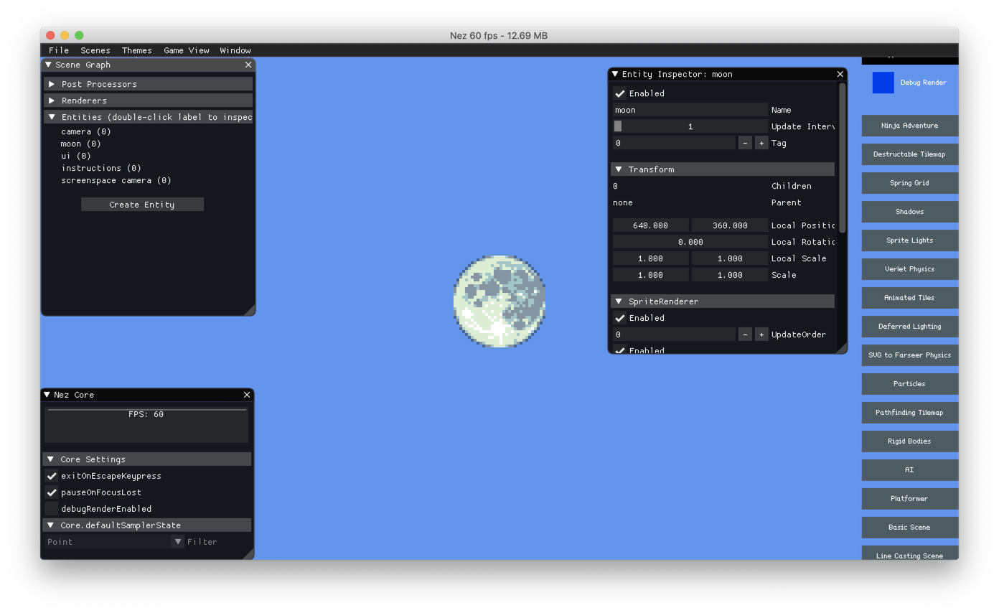

Dear IMGUI
==========

## Setup 配置

你的主项目应该包含对 Nez.ImGui 项目的引用. ImGui UI 可以通过两种方式展现: 手动安装一个 `GlobalManager`, 或使用 Nez 的调试控制台. ImGui 会安装它自己的指令 (toggle-imgui), 负责为你安装 `GlobalManager`. 注意 ImGui 是一套自己的程序集, 如果你想要它的指令被加载的话你需要手动加载程序集. 像这样: `System.Reflection.Assembly.Load("Nez.ImGui")`.

手动安装 ImGui manager 如下所示:

```csharp
var imGuiManager = new ImGuiManager();
Core.RegisterGlobalManager( imGuiManager );

// 开关 ImGui 渲染, 默认是开启的
imGuiManager.SetEnabled(false);
```



更多信息和例子见 [Nez.ImGui README](../../Nez.ImGui/README.md)
