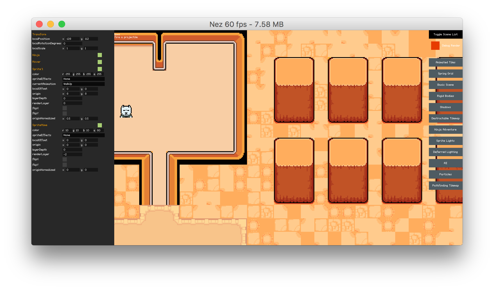

Runtime Inspector 运行时检索器
==========
Nez 包含一些超级有用的运行时检索 Entity 和 PostProcessor 的东西. 只需在调试控制台(~键打开)中输入 `inspect` 指令. 一些开箱即用地被检索的类型有: int, float, string, bool, enum, Color, 一些 structs, Effect 子类和变换. 当你使用 `inspect` 指令时你既可以传递一个实体名字也能传递 `pp`, 这样之后我们能直接检索场景里的所有 PostProcessors.



## Exposing Properties and Fields in the Inspector 在检索器中暴露属性和字段
默认检索器只会展示受支持的公共属性/字段. 它也会检索非空 Effect 的 Materials 属性, 尽可能展示所有 Effect 可用的属性. 检索器也能展示私有字段/属性, 向它们装饰一个 `Inspectable` 特性就行了, 像这样:

```csharp
[Inspectable]
string myPrivateField;
```

int 和 float字段/属性 可以被可选的以滑动条的形式展现. 向它们装饰一个 `Range` 特性就行了. 注意你不需要同时装饰 `Inspectable` 和 `Range` 特性到私有成员上, 因为 `Range` 特性已经让 Nez 知道你要展示这个成员了.

```csharp
[Range( 0.1f, 100 )]
float groundAccel;

// 第三个可选的参数指定了滑动条的步长.
[Range( 0.1f, 100, 5 )]
float airAccel;
```


## Exposing Methods in the Inspector 在检索器中暴露方法
检索器也有能力向面板加入调用方法的按钮. 方法必须只能有 0 或 1 个参数, 而且参数必须是 int, float, bool 或 string 类型. 为了暴露一个方法, 你需要在一个方法上装饰 `InspectorCallable` 特性. 例子如下:

```csharp
[InspectorCallable]
public void DoSomething()
{}


[InspectorCallable]
public void DoSomethingWithParameter( bool isDone )
{}


[InspectorCallable]
public void ThisWontWorkBecauseItHasTwoParameters( bool isDone, int stuff )
{}
```


## Tooltips 提示
你可以向检索器加入提示, 通过装饰一个 `TooltipAttribute` 特性. 这个提示会在你鼠标悬浮时展示.


```csharp
[Tooltip( "Acceleration when on the ground" )]
float groundAccel = 1.0f;
```


## Extending the Inspector 拓展检索器
你可以在检索器里展示所有自定义类型, 搞出你自定义的检索器也行. 你可以通过装饰一个 `CustomInspector` 特性到一个你想让其成为自定义检索器的类上(例子在下面). 这个特性接受单个类型为 `Inspector` 子类的参数, 该子类应该管理这个类的检索器UI(例子也在下面). 注意 `Inspector` 子类应该被 #if/#endif 预编译指令环绕, 以便仅在调试构建下被编译.

`Inspector` 类提供了几个方法帮助你制作自定义检索器. 它会缓存 getter/setter 对 field/property 的值以便更简单的访问. 它也对 getter/setter 封装了 `GetValue` 和 `SetValue` 的泛型方法帮助你更好地进行类型转换. 如果你想要加入你自己特性到 字段/属性 上的话, 有个 `GetFieldOrPropertyAttribute` 的泛型方法能帮助你访问.


```csharp
[CustomInspector( typeof( YourClassInspector ) )]
public class YourClass
{
	bool _isBlue { get; set; }
	float _friction;
	// 类的剩余部分
}


#if DEBUG
public class YourClassInspector : Inspector
{
	// 建立你的 UI 然后加入面板
	public override void Initialize( Table table, Skin skin )
	{}

	// 这是你更新你 UI 的地方
	public override void Update()
	{}
}
#endif
```
