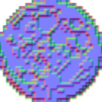
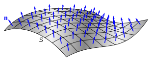

The Deferred Lighting system lets you use real lights in your scene. Included light types are point, directional, spot and area lights.
Okay, but what is meant by a real light, you may ask? A real light is passed to an effect that calculates the lighting based on position/rotation/amplitude etc. A sprite light on the other hand is just a lightmap texture. The advantage of Deferred Lighting is that you can use normal maps to create a realistic shadow effect.

A normal is a vector that points straight off of a surface. 
Normals have a central role in shading. An object becomes brighter when we point it at a light source.

A normal map is a texture where the RGB values are used to store the normal values per pixel.




Normal maps are widely used in 3D Games to add details without adding more polygons.




Deferred lighting is a method of rendering that defers dealing with lights until after all objects are rendered. This makes having lots of lights more efficient. The general gist of how it works is like this: first, we render all objects to a diffuse render texture and render their normal maps to a normal render texture simultaneously (via multiple render targets). All of the lights are then rendered using the normal data into a 3rd render texture. Finally, the light render texture and the diffuse render texture are combined for the final output. You can see the output of all of the render textures by toggling the `DeferredRenderer.EnableDebugBufferRender` property at runtime.

## Tools
Here are some tools you can use to create normal maps.

- [AwesomeBump](https://github.com/kmkolasinski/AwesomeBump) (Free)
- [ModLab](https://store.steampowered.com/app/768970/ModLab/) (Free)
- [Blender](https://www.blender.org/) (Free)
- [SpriteIlluminator](https://www.codeandweb.com/spriteilluminator) (Paid)
- [spritelamp](http://www.spritelamp.com/) (Paid)
- [sprite-dlight](http://www.2deegameart.com/p/sprite-dlight.html) (Paid)


## Material Setup
This is where using the deferred lighting system differs from your normal workflow when making a 2D game. In most games without realtime lighting you wont ever need to touch the Material system at all. Deferred lighting needs additional information (mainly normal maps) in order to calculate lighting so we have to dive into Nez's Material system. We won't get into actual asset creation process here so it is assumed that you know how to create (or auto-generate) your normal maps.

One neat trick the Nez deferred lighting system has baked in is self illumination. Self illuminated portions of your texture don't need to have a light hit them for them to be visible. They are always lit. You can specify which portions of your texture should be self illuminated via the alpha channel of your normal map. A 0 value indicates no self illumination and a value of 1 indicates fully self illuminated. Don't forget that premultiplied alpha must not be used when using self illumination! Nez needs that alpha channel intact to get the self illumination data. When using self illumination you have to let Nez know by setting `DeferredSpriteMaterial.SetUseNormalAlphaChannelForSelfIllumination`. Additional control of self illumination at runtime is available by setting `DeferredSpriteMaterial.SetSelfIlluminationPower`. Modulating the self illumination power lets you add some great atmosphere to a scene.

There are going to be times that you don't want your objects normal mapped or maybe you havent created your normal maps yet. The deferred lighting system can accommodate this as well. There is a built-in "null normal map texture" that you can configure in your Material that will make any object using it only take part in diffuse lighting. By default, `DeferredLightingRenderer.material` will be a Material containing the null normal map. Whenever a Renderer encounters a RenderableComponent with a null Material it will use it's own Material. What that all means is that if you add a RenderableComponent with a null Material it will be rendered with just diffuse lighting.

Below are the three most common Material setups: normal mapped lit, normal mapped lit self illuminated and only diffuse (no normal map).

```csharp
// lit, normal mapped Material. normalMapTexture is a reference to the Texture2D that contains your normal map.
var standardMaterial = new DeferredSpriteMaterial( normalMapTexture );


// diffuse lit Material. The NullNormalMapTexture is used
var diffuseOnlylMaterial = new DeferredSpriteMaterial( deferredRenderer.NullNormalMapTexture );


// lit, normal mapped and self illuminated Material.
// first we create the Material with our normal map. Note that your normal map should have an alpha channel for the self illumination and it
// needs to have premultiplied alpha disabled
var selfLitMaterial = new DeferredSpriteMaterial( selfLitNormalMapTexture );

// we can access the Effect on a Material<T> via the `TypedEffect` property. We need to tell the Effect that we want self illumination and
// optionally set the self illumination power.
selfLitMaterial.effect.SetUseNormalAlphaChannelForSelfIllumination( true )
	.SetSelfIlluminationPower( 0.5f );
```

## Scene Setup

:::info
The assets from this example can be downloaded [here](../../../assets/deferredlight_assets.zip).
:::

There isn't much that needs to be done for your Scene setup. All you have to do is add a `DeferredLightingRenderer`. The values you pass to the constructor of this Renderer are very important though! You have to specify which RenderLayer it should use for lights and which RenderLayers contain your normal sprites.

```csharp
// define your renderLayers somewhere easy to access
const int LIGHT_LAYER = 1;
const int OBJECT_LAYER1 = 10;
const int OBJECT_LAYER2 = 20;

// add the DeferredLightingRenderer to your Scene specifying which renderLayer contains your lights and an arbitrary number of renderLayers for it to render
var deferredRenderer = AddRenderer(new DeferredLightingRenderer(0, LIGHT_LAYER, OBJECT_LAYER1, OBJECT_LAYER2));

// optionally set ambient lighting
deferredRenderer.SetAmbientColor(Color.Gray);
```


## Entity Setup
Now we just have to make sure that we use the proper RenderLayers (easy to do since we were smart and made them `const int`) and Materials when creating our Renderables:

```csharp
// Create the material with the normal map
var standardMaterial = new DeferredSpriteMaterial(normalMapTexture);

// create an Entity to house our sprite
var entity = CreateEntity("sprite");
// add a Sprite and here is the important part: be sure to set the renderLayer and material
entity.AddComponent(new SpriteRenderer(spriteTexture))
	.SetRenderLayer(OBJECT_LAYER1)
	.SetMaterial(standardMaterial);
entity.Transform.Position = Screen.Center;

// create an Entity to house our PointLight
var lightEntity = CreateEntity("point-light");
lightEntity
	.AddComponent(new MouseFollow());

// add a PointLight Component and be sure to set the renderLayer to the lights layer!
lightEntity.AddComponent(new PointLight(Color.White).SetIntensity(0.8f))
.SetRenderLayer(LIGHT_LAYER);
```

