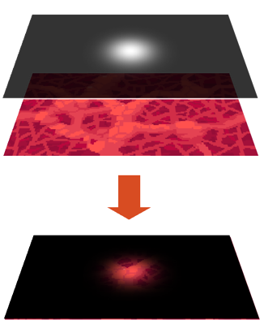

SpriteLight rendering is a simple 2d light rendering technique where sprites are used to form a lightmap.
This lightmap is then used to illuminate the scene.



:::info
The assets from this example can be downloaded [here](../../../assets/spritelight_assets.zip).
:::

# Sample

We start by setting up the render layers

```cs
public const int SpriteLightRenderLayer = 1;
public const int BackgroundRenderLayer = 2;
```

Next, we add a renderer for the drawables in our scene.
```cs
AddRenderer(new RenderLayerRenderer(0, BackgroundRenderLayer));
```

Next, we create a renderer for our light map. We assign a `RenderTexture` to which the light map will be rendered. 

`RenderTargetClearColor` is used to create a slight ambient color. If you have a scene that is reasonably lit, you could use, for example, `new Color(100, 100, 100, 255);`
```cs
RenderLayerRenderer lightRenderer = AddRenderer(new RenderLayerRenderer(-1, SpriteLightRenderLayer));
lightRenderer.RenderTexture = new RenderTexture();
lightRenderer.RenderTargetClearColor = new Color(10, 10, 10, 255);
```

Next, we add our background, which we render to `BackgroundRenderLayer`.
```cs
var bgTexture = Content.Load<Texture2D>("background");
var bgEntity = CreateEntity("bg");
bgEntity.Position = Screen.Center;
bgEntity.Scale = new Vector2(9.4f);
var bgSprite = bgEntity.AddComponent(new SpriteRenderer(bgTexture));
bgSprite.RenderLayer = BackgroundRenderLayer;
```

Next we add our light, which we render to `SpriteLightRenderLayer`.
```cs
var lightTexture = Content.Load<Texture2D>("spritelight");
var lightEntity = CreateEntity("light");
lightEntity.Position = new Vector2(Screen.Width / 2f, Screen.Height / 2f);
lightEntity.Scale = new Vector2(4);
var lightSprite = lightEntity.AddComponent(new SpriteRenderer(lightTexture));
lightSprite.RenderLayer = SpriteLightRenderLayer;
```

And finally we add the `SpriteLightPostProcessor`, which renders the scene using the lightmap `RenderTexture`.

```cs
AddPostProcessor(new SpriteLightPostProcessor(0, lightRenderer.RenderTexture));
```

