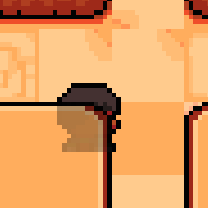

The Stencil Test is a per-sample operation performed after the Fragment Shader. The fragment's stencil value is tested against the value in the current stencil buffer; if the test fails, the fragment is culled. 

If you want to get a deeper understanding of stencil buffers I recommend checking out the following resources.

- https://learnopengl.com/Advanced-OpenGL/Stencil-testing
- https://www.khronos.org/opengl/wiki/Stencil_Test
- https://www.youtube.com/watch?v=1URn35cymX4

Stecil buffers can be used, for example, to render shadows and outlines.


# Samples

:::info
The assets from this example can be downloaded [here](../../assets/stencil_assets.zip).
:::

## Shadow

For this example, I used the shadow mechanism from  [NinjaAdventure](https://github.com/prime31/Nez-Samples/tree/master/Nez.Samples/Scenes/Samples/Ninja%20Adventure).

In this example, I'll show you how to draw a shadow when a player is hidden behind an object, so you can still see where the player is.

We achieve this by rendering a shadow sprite over the column. We use the stencil buffer to ensure that the player sprite is not rendered in the places where the player can be seen. We do this by filling the stencil buffer in the places where the player sprite is hidden.



We begin by creating the floor entity. We assign it `RenderLayer` 1, so that it will be rendered at the back.

```cs
Entity floor = CreateEntity("floor");
floor.Position = center;
var floorSprite = floor.AddComponent(new SpriteRenderer(floorTexture));
floorSprite.RenderLayer = 2;
```

Next we create the column.
We assign this `RenderLayer` 0 so that it is rendered before the player (`RenderLayer` 1)
We also set the `Material` to `StencilWrite`, this ensures that the stencil buffer is filled at the location where the column sprite is rendered. We do this so that we can make sure the shadow sprite is only rendered at that location
```cs
Entity column = CreateEntity("column");
column.Position = center;
var columnSprite = column.AddComponent(new SpriteRenderer(columnTexture));
columnSprite.Material = Material.StencilWrite();
columnSprite.RenderLayer = 0;
```

Next, we add the player. We render it on `RenderLayer` 1, so it will render behind the column.
```cs
var player = CreateEntity("player");
var offset = new Vector2(50,0);
player.Position = center - offset;
SpriteRenderer playerSprite = player.AddComponent(new SpriteRenderer(playerTexture));
playerSprite.SetRenderLayer(1);
```

I use a tween to move the player back and forth.
```cs
player.TweenPositionTo(center + offset, 2f).SetEaseType(EaseType.Linear).SetLoops(LoopType.PingPong,-1).Start();
```

Finally, we add the player's shadow.
We use `Material.StencilRead` and `RenderLayer` 1 so that the shadow is only rendered when the player is behind the column.
```cs
var playerShadowSprite = player.AddComponent(new SpriteMime(playerSprite));
playerShadowSprite.Color = new Color(10, 10, 10, 80);
playerShadowSprite.Material = Material.StencilRead();
playerShadowSprite.RenderLayer = -1;
```


## X-Ray

This example makes use of stencil buffers by not rendering a certain part, allowing us to create an xray effect.

We start off by creating the earth entity
```cs
Entity earth = CreateEntity("earth");
earth.Transform.Position = Screen.Center;
earth.Transform.Scale = new Vector2(6, 6);
```

Next, we add a sprite to our entity with a `StencilRead(0)` Material.
This material ensures that the Pixels of the sprite are only drawn if the data at that position in the stenicl buffer is 0.

```cs
var earthSprite = earth.AddComponent(new SpriteRenderer(earthTexture));
earthSprite.Material = Material.StencilRead(0);
```

We set the `RenderLayer` to 0, so it will be rendered on top of the other sprites.
```cs
earthSprite.RenderLayer = 0;
```

The core of the earth is just a sprite that we render under the earth sprite.
```cs
Entity earthCore = CreateEntity("earthCore");
earthCore.Transform.Position = Screen.Center;
earthCore.Transform.Scale = new Vector2(6, 6);
var coreSprite = earthCore.AddComponent(new SpriteRenderer(earthCoreTexture));
coreSprite.RenderLayer = 1;
```

Now we add the x-ray component. This is just a square that is rendered under the other sprites and follows the mouse.
We give this square the `StencilWrite` `Material`, this ensures that the data in the stencil buffer is set to 1 where the pixels are rendered.
```cs
var xray = CreateEntity("x-ray");
xray.AddComponent(new MouseFollow());
xray.AddComponent(new PrototypeSpriteRenderer(150, 150))
    .SetRenderLayer(2)
    .SetMaterial(Material.StencilWrite());
```

Because the stencil buffer is now 1 at the location of the x-ray component, the earth is not rendered there because it uses `StencilRead` 0.
That's why in that place you see the core sprite.

You could also have achieved this effect by only rendering the core over the earth where the xray sprite is.


