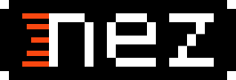

Nez 是一个基于 MonoGame/FNA 的多功能 2D 游戏框架. 它提供了你制作 2D 游戏的地基. 一些它拥有的特性比如:

- Scene/Entity/Component 系统,同时拥有组件层级渲染系统
- 提供高速 broadphase 物理系统查询的 SpatialHash. 尽管你甚至不会看到它的影子, 因为它是在场景幕后工作的, 但是你依然会喜欢上它的接近疯狂的射线碰撞或重叠碰撞检查的速度!
- AABB, 圆和多边形碰撞/触发器 碰撞
- Farseer 物理系统(基于 Box2D)集成, 当你需要一个完整的物理模拟的时候
- 高效的协程, 允许你很轻松的将跨多帧的大型任务或动画时间控制进行分割(Core.startCoroutine)
- 游戏内置可拓展调试控制台, 仅仅只需要向一个静态方法加入一个特性. 按下 ~ 键就像以前的 Quake 一样. 它包含开箱即用的可视化物理调试系统, 资源监视器, 基础的 profile 工具和更多. 在控制台上键入 'help' 查看所有可用的指令, 同时使用 'help COMMAND' 查看更详细的指令介绍.
- 内置在游戏里的调试面板 Dear ImGui, 让你能够自己布置你自己的 ImGui 窗口通过特性
- 内置的组件检查器. 打开调试控制台, 输入指令 `inspect ENTITY_NAME` 就能查看和编译字段/属性并且调用函数仅仅通过一个鼠标点击
- Nez.Persistence 中的 JSON, NSON(类JSON,高可读性,强类型), 和二进制序列化支持, JSON/NSON 提供了自动解决引用, 类的多态的能力
- 可拓展的渲染系统, 随时按需加入或移除 Renderers 和 PostProcessors. Renderables (可渲染的)首先使用 render layer 排序, 然后使用 layer depth 排序来进行渲染深度管理, 这提供了最大的弹性, 同时包含开箱即用的自定义排序器
- 寻路系统, 使用 A* 算法和广度优先搜索, 支持 tilemaps 或自定义的格式
- 法线贴图的延迟光照引擎支持, 同时包含运行时或预制的法线贴图生成
- 缓动系统, 缓动任何 int/float/Vector/quaternion/color/rectangle 类型的字段或属性
- sprites 动画, scrolling sprites, repeating sprites 和 sprite 拖尾支持
- 灵活的线渲染器, 包含可配置的端点样式, 超丝滑圆角边缘, 及闪电般的尖锐边缘
- 强大的粒子系统, 支持运行时导入粒子样式文件
- 优化的事件触发器(`Emitter` class), 用于 core events, 支持自定义事件
- 延迟/重复执行任务的 scheduler (`Core.schedule`方法)
- 预场景资源管理器, 加载你场景所需的资源, 然后忘掉它. Nez 会在场景变化时自动释放你加载的资源
- 可定制的场景过渡系统, 包含几个预制的过渡效果
- Verlet 物理体, 带来超级有趣, 粒子约束的物理模拟
- 大量的其他特性

Nez Systems
==========

- [Nez-Core](FAQs/Nez-Core.md) ([译制](FAQs/lang.cn_wip/Nez-Core.md))
- [Scene-Entity-Component](FAQs/Scene-Entity-Component.md) ([译制](FAQs/lang.cn_wip/Scene-Entity-Component.md))
- [Rendering](FAQs/Rendering.md) ([译制](FAQs/lang.cn_wip/Rendering.md))
- [Content Management](FAQs/ContentManagement.md) ([译制](FAQs/lang.cn_wip/ContentManagement.md))
- [Dear IMGUI](FAQs/DearImGui.md) ([译制](FAQs/lang.cn_wip/DearImGui.md))
- [Nez Physics/Collisions](FAQs/Physics.md)
- [Farseer Physics](FAQs/FarseerPhysics.md)
- [Scene Transitions](FAQs/SceneTransitions.md) ([译制](FAQs/lang.cn_wip/SceneTransitions.md))
- [Pathfinding](FAQs/Pathfinding.md)
- [Runtime Inspector](FAQs/RuntimeInspector.md) ([译制](FAQs/lang.cn_wip/RuntimeInspector.md))
- [Verlet Physics](FAQs/Verlet.md)
- [Entity Processing Systems](FAQs/EntitySystems.md) ([译制](FAQs/lang.cn_wip/EntitySystems.md))
- [Nez.UI](FAQs/UI.md)
- [Nez.Persistence](Nez.Persistence/README.md)
- [Nez.ImGui](Nez.ImGui/README.md)
- [SVG Support](FAQs/SVG.md) ([译制](FAQs/lang.cn_wip/SVG.md))
- [AI (FSM, Behavior Tree, GOAP, Utility AI)](FAQs/AI.md)
- [Deferred Lighting](FAQs/DeferredLighting.md) ([译制](FAQs/lang.cn_wip/DeferredLighting.md))
- [Samples](FAQs/Samples.md) ([译制](FAQs/lang.cn_wip/Samples.md))

Setup 构建
==========
### 作为子模块构建:

- 创建一个 `Monogame Cross Platform Desktop Project` 项目
- clone 或者下载这个仓库
- 向你的解决方案和项目加入 `Nez.Portable/Nez.csproj` 的引用
  - 如果你使用MonoGame 3.8, 请用`Nez.Portable/Nez.MG38.csproj`代替
- 创建你的主游戏类(默认项目里是`Game1.cs`类), 并且继承`Nez.Core`

如果你希望使用任何内建的特效和 PostProcessors 你也要链接 `DefaultContent/effects` 目录到你项目的 `Content/nez/effects` 目录, `DefaultContent/textures` 到 `Content/nez/textures` 同理. 确保你的 Content 构建动作设置了 "复制到输出目录" 属性, 这样它们才会复制到你编译好的游戏里. 例子见 Nez.Samples 项目.

注意: 如果你得到了一个 `project.assets.json` 文件缺失的编译错误, 请在Nez根目录运行 `msbuild Nez.sln /t:restore` 以修复它们.

### 通过NuGet包安装:

NuGet 包自废弃已经很久了. 源码里有内容很详细很有用的注释, 请使用源码.
---

所有 Nez 的 shaders 都是为 OpenGL 编译的, 所以请确保使用 DesktopGL 模板, 不要用 DirectX! Nez 只支持 OpenGL 的开箱即用, 以确保跨 安卓/iOS/Mac/Linux/Windows 平台.

如果你需要开发一个移动端应用, 你需要调用 `Input.Touch.EnableTouchSupport()` 来开启触屏的支持.

一些例子的仓库
==========
你可以找到一些例子仓库在[这里](https://github.com/prime31/Nez-Samples). 包含很多例子场景, 演示了很多Nez的基本内容. 这个[Youtube 列表](https://www.youtube.com/playlist?list=PLb8LPjN5zpx0ZerxdoVarLKlWJ1_-YD9M)也包含了一些相关的内容.

使用 FNA 来使用 Nez
==========
注意你必须安装所需要的 FNA 本机库, 这是你使用 FNA 来使用 Nez 需要准备做的事:

- clone 这个仓库, 递归地包含子模块
- 打开Nez的解决方案 (Nez/Nez.sln) 然后构建它. 以让 NuGet 包保持最新.
- 下载/clone FNA
- 打开你的游戏项目并且加入 FNA 和 Nez.FNA 的引用
- (可选) 按需加入 Nez.FNA.ImGui 或 Nez.FNA.FarseerPhysics 的引用

期望的目录结构如下:

- TopLevelFolderHousingEverything
	- FNA
	- YourGameProject
	- Nez

或者, 你可以使用提供给 Visual Studio 和 VS Code 的 Nez + FNA 模板在[这里](https://github.com/prime31/FNA-VSCode-Template)

### 鸣谢/贡献
Nez 的点点滴滴都来自互联网的各地. 如果你看到一些熟悉的代码但没有被注明, 请提一个带详细信息的 issue, 这样我们可以注明这个代码.

我在此特别感谢三位, 他们的仓库列表如下. Monocle Engine 和 MonoGame.Extended 让我在第一次思考 MonoGame 是否适合制作游戏时让我几乎立刻就准备好并且使用 MonoGame 启动了游戏. [libGDX](https://github.com/libgdx/libgdx) scene2D UI 对 Nez 的 UI 系统制作是一个巨大的飞跃. Nez 使用了很多来自下面三个仓库的代码和想法:

- Maddy Thorson's fantastic Monocle Engine  
(译注: maddy 给的仓库链接已失效, github上有个[镜像仓库](https://github.com/shortgecko/MonocleEngineMirror))

- Dylan Wilson 的精彩的 [MonoGame.Extended](https://github.com/craftworkgames/MonoGame.Extended) 和它对 [Farseer Physics Engine](https://farseerphysics.codeplex.com/) 转化成便携库的初步工作. Farseer 以 [Microsoft Permissive v1.1](https://farseerphysics.codeplex.com/license) 许可.

- Nathan Sweet 的 libGDX 的 Scene2D UI [libGDX](https://github.com/libgdx/libgdx). Nez UI 基于 libGDX Scene2D, 其以 [Apache 许可](UI_LICENSE).

 

结尾译注:  
所有文档以英文原版为准, 初稿由[Saplonily](https://github.com/Saplonily)翻译, 可能缺少校对, 部分专业名词、术语可能翻译不准确. 故仅供个人学习参考.